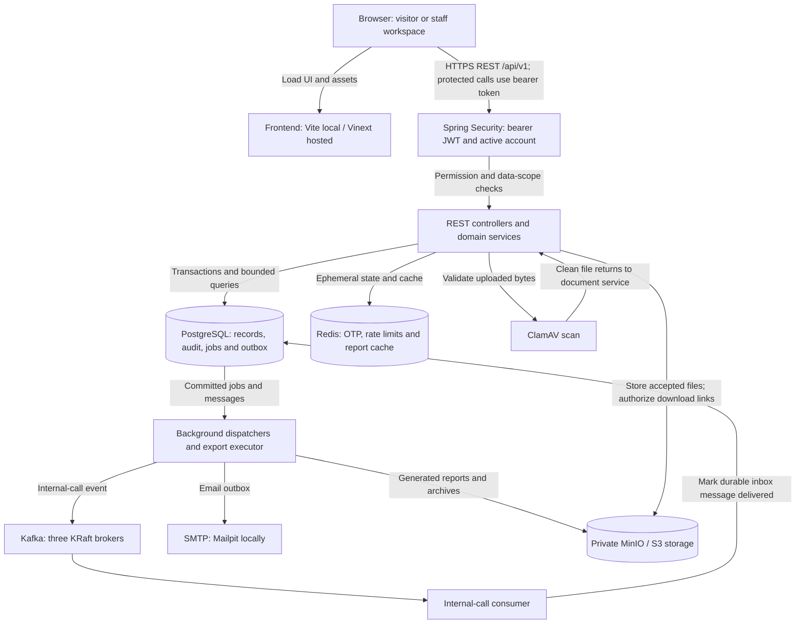
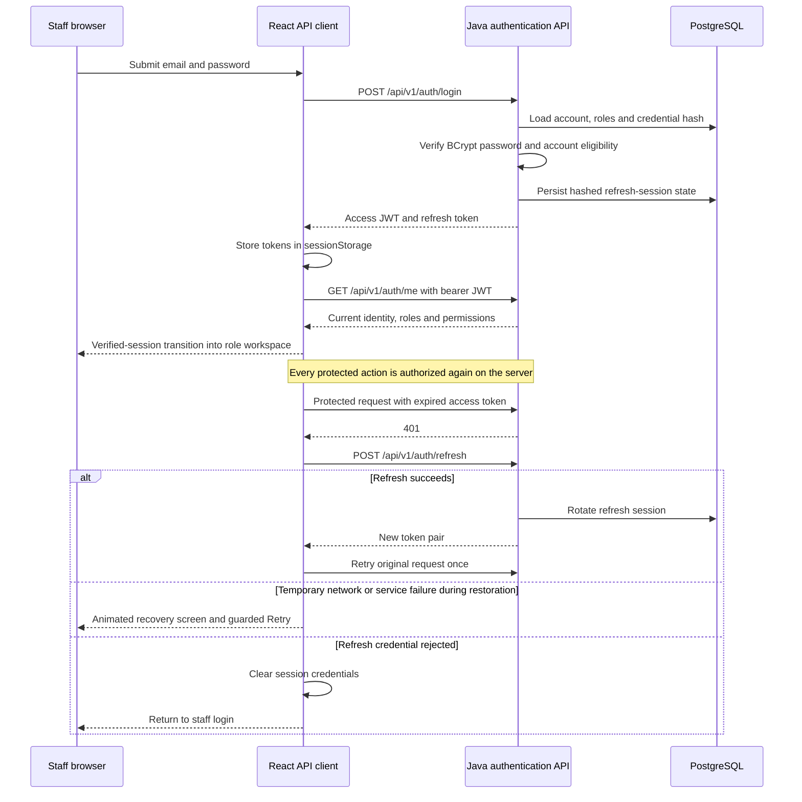
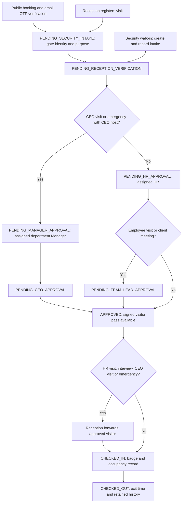
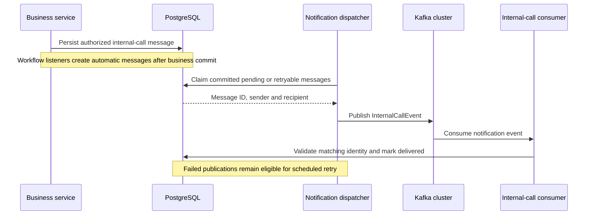
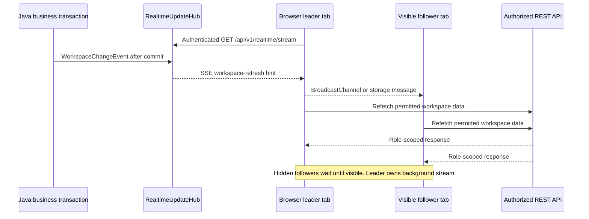
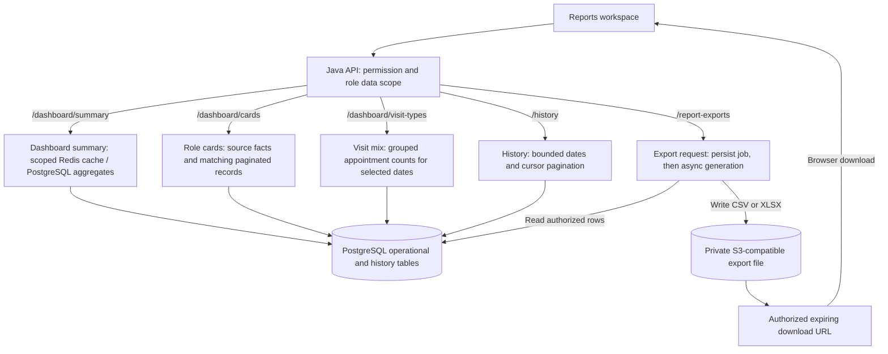

# BrainServe Connect

Production-oriented workplace operations platform for BrainServe Connect. The repository contains:

- An independent project in `frontend/`, with a responsive React/TypeScript frontend using Next.js-compatible APIs through Vinext/Vite, with red-and-white glassmorphism.
- A Java 21 Spring Boot backend under `backend/`.
- PostgreSQL migrations, Redis OTP state, a transactional email outbox, audit logging, Docker images and local orchestration.
- Encrypted cold archives, dataset-specific retention, legal holds, immutable
  governance evidence, and backup expiry. See
  [`ops/DATA_RETENTION_RUNBOOK.md`](ops/DATA_RETENTION_RUNBOOK.md).

[Technology stack](#technology-stack) · [System architecture](#system-architecture) · [Local setup](#run-locally-with-your-installed-services) · [Docker setup](#run-the-complete-stack-with-docker) · [Windows troubleshooting](#windows-dependency-troubleshooting)

## Working with V2.0

Run npm commands from `frontend/` and Maven from `backend/`. Start with the [frontend architecture and feature editing guide](docs/FRONTEND_ARCHITECTURE.md).

The [reliability audit](docs/V2_AUDIT.md), [product roadmap and sprint estimates](docs/PRODUCT_ROADMAP.md), and [requirements and release gates](docs/V2_REQUIREMENTS.md) distinguish completed fixes from planned commercial, enterprise and SaaS work.

```sh
cd frontend
npm ci
npm run dev:backend
```

## Technology stack

Versions below describe the corrected source snapshot reviewed on 16 September 2026. `frontend/package-lock.json`, `backend/pom.xml` and `docker-compose.yml` remain authoritative for installation.

| Layer | Technology | How BrainServe uses it |
| --- | --- | --- |
| Interface |  **React 19.2.8** ·  **TypeScript 5.9.3** | Public booking and staff workspaces; typed API requests and role-specific screens. |
| Frontend runtime |  **Next.js 16.3.5 APIs** · **Vinext 1.0.0-beta.8** ·  **Vite 8.2.2** | App Router-compatible frontend built through `vinext build`; Vite serves local development. |
| Styling | **Tailwind CSS 4.2.1**, CSS/CSS Modules, Lucide React, Manrope and Newsreader | Responsive layouts, icons, glass panels and CSS-transform recovery animations. |
| Business API |  **Java 21** ·  **Spring Boot 3.5.7** · **Spring Modulith 1.4.7** | One modular backend application with REST controllers, domain services, transactions and module-boundary tests. |
| Identity and access | **Spring Security**, JWT, BCrypt, Jakarta Validation | Stateless bearer authentication, active-account checks, method permissions, department/host scope and input validation. |
| Durable data |  **PostgreSQL 17.2** · Spring Data JPA/Hibernate · JDBC · Flyway | Accounts, appointments, employee records, audit history, durable notifications and report jobs; versioned migrations. |
| Short-lived state |  **Redis 7.4.1** | OTP/challenge state, request rate limits and role-scoped dashboard caching. |
| Internal messaging |  **Apache Kafka 3.9.1** · Spring Kafka | Three-node KRaft cluster; durable internal-call delivery through `brainserve.internal-calls.v1`. |
| Files and exports | **MinIO / S3-compatible storage**, AWS SDK, **ClamAV 1.4**, Apache POI | Private employee files, malware scanning, expiring downloads, CSV/XLSX exports and encrypted archives. |
| Email and QR | **Spring Mail / SMTP**, **Mailpit 1.21**, **ZXing 3.5.3**, `qrcode` | Outbox-delivered emails and OTPs; signed visitor passes and QR rendering/verification. |
| Runtime and deployment |  **Node.js ≥22.13** (CI: 24) · Maven ≥3.9 ·  **Docker Compose** | Frontend toolchain, Java build and local service orchestration. |
| Hosted frontend tooling |  **Cloudflare Vite plugin 1.54.9**, Wrangler 4.131.2, Workerd | Worker build/hosting path. Local Spring Boot development selects `BRAINSERVE_LOCAL_BACKEND=1` to bypass the Cloudflare Vite plugin. |
| Verification and operations |  **GitHub Actions** ·  **Playwright 1.55.1** · JUnit/Mockito · Testcontainers · Actuator/Micrometer | CI builds, browser and backend tests, health probes and Prometheus-format metrics. |

Technology logos are provided by [Devicon](https://github.com/devicons/devicon), pinned to a versioned CDN URL. They require network access in the Markdown viewer; text labels remain readable without images. PostgreSQL, Redis, Kafka and ClamAV versions above are the Compose image versions. The repository also contains Drizzle/D1/R2 hosting scaffolding; the operational Java API stores business records in PostgreSQL.

## System architecture

BrainServe has a separately served React frontend and **one Spring Boot modular monolith**. Domain modules run in the same Java process. PostgreSQL is the durable business store; Redis, Kafka, SMTP and object storage have distinct supporting roles. The browser calls the Java API through `NEXT_PUBLIC_API_BASE_URL` and never connects directly to PostgreSQL, Redis or Kafka.

### Runtime and data boundaries



The frontend host delivers the interface; authentication and business decisions happen in Java. Email dispatch and Kafka delivery run outside the business request's database transaction after durable work is available. Report exports run on the backend's asynchronous executor. No separate report microservice is required.

**Source:** [`frontend/vite.config.ts`](frontend/vite.config.ts), [`frontend/services/brainserve-api.ts`](frontend/services/brainserve-api.ts), [`SecurityConfiguration.java`](backend/src/main/java/com/brainserve/appointment/iam/config/SecurityConfiguration.java), [`docker-compose.yml`](docker-compose.yml).

### Login, authorization and reconnecting



On a page reload, session restoration verifies the stored session before opening a workspace. Temporary restoration failures retain credentials for retry. Missing backend configuration fails closed. The initial authenticated workspace also shows recovery when both core appointment and summary loads fail transiently; later refresh failures retain previously loaded content. The recovery page supports pause/resume and reduced motion and cannot grant roles or bypass authentication.

**Source:** [`frontend/features/workspace/brainserve-root.tsx`](frontend/features/workspace/brainserve-root.tsx), [`frontend/hooks/workspace/use-workspace-data.ts`](frontend/hooks/workspace/use-workspace-data.ts), [`frontend/components/shared/connection-recovery.tsx`](frontend/components/shared/connection-recovery.tsx), [`frontend/services/brainserve-api.ts`](frontend/services/brainserve-api.ts), [`iam`](backend/src/main/java/com/brainserve/appointment/iam).

### Frontend modules for V2.0

The independent `frontend/` project follows the Client Onboarding layout: thin `app/` route files, business features in `features/`, shared components, hooks, libraries, and types. Workboard has its own pages, state/action hook, API, contracts, utilities, and screen registration in [`frontend/features/workboard/`](frontend/features/workboard/). See its [editing guide](frontend/features/workboard/README.md).

See [Frontend architecture and editing guide](docs/FRONTEND_ARCHITECTURE.md) for the folder map, dependency rules, and validation results.

### Appointment journey and approval branches

The service chooses the route from visit type, selected host, routing department and active leadership assignments. The following is the successful path; each permitted rejection/cancellation is validated against the persisted appointment state.



- Public booking creates `PENDING_VERIFICATION`; successful OTP verification advances it to Security intake.
- CEO visits and emergencies hosted by the CEO require **Manager → CEO** approval after Reception verification.
- Employee visits and client meetings require **HR → Team Lead** approval. Other eligible HR routes can complete at HR.
- Reception forwarding is required before check-in for HR visits, interviews, CEO visits and emergencies. An approved QR pass does not bypass this rule.
- Actor IDs, timestamps, remarks and status transitions are persisted. Read-only CEO occupancy access does not grant check-in/check-out authority.

**Source:** [`Appointment.java`](backend/src/main/java/com/brainserve/appointment/appointment/domain/Appointment.java), [`AppointmentService.java`](backend/src/main/java/com/brainserve/appointment/appointment/application/AppointmentService.java), [`reception`](backend/src/main/java/com/brainserve/appointment/reception).

### Durable notifications and live workspace updates

Internal calls and live UI updates follow different paths:



Recipient inbox APIs read durable delivered rows; Kafka is the transport, not the inbox database. SMTP uses its own PostgreSQL email outbox, with scheduled dispatch, retry and dead-letter state.



Web Locks and a storage-lease fallback coordinate the leader. The SSE message is a refresh hint, so each tab still fetches through its own authenticated API client. The server sends heartbeats and the client reconnects after interruptions. If browser coordination APIs/storage are unavailable, the code can fall back to one stream per tab.

`RealtimeUpdateHub` holds emitters in one JVM. This snapshot does not implement a distributed SSE fan-out between backend replicas; a multi-instance deployment needs that topology considered separately. Kafka's three-broker durability does not turn the Java application into microservices or provide cross-instance SSE delivery automatically.

**Source:** [`notification`](backend/src/main/java/com/brainserve/appointment/notification), [`realtime`](backend/src/main/java/com/brainserve/appointment/realtime), [`subscribeToWorkspaceUpdates`](frontend/services/brainserve-api.ts).

### Reports, history and exports

System Admin and CEO overviews also provide versioned measurement cards with
explicit scope, office-period/live clocks, source coverage and matching authorized
record lists. Missing instrumentation remains visibly unavailable. See the
[Sprint 3 metric and rollout contract](docs/SPRINT_3.md).

System Admin can resume the company setup checklist from Settings. Safe imports
provide bounded CSV templates, row validation, current-permission checks and
durable per-row results for departments, employee profiles and pending visits.
Profile imports do not provision accounts; visitor imports retain the existing
approval process. See [Sprint 4 setup, imports and recovery](docs/SPRINT_4.md).



The overview and historical explorer coexist. CEO/System Admin company scope, department roles and personal Employee scope are resolved on the backend. Missing department assignments cannot fall back to company-wide dashboard/chart totals. The current summary refresh runs every 60 seconds by default; dashboard cache defaults to 180 seconds. Summary cards can therefore lag direct visit-type counts briefly. Applying a new date range clears old overview values; a failed refresh of the same range can retain last-good values with an error message.

A separate API-request usage meter is not implemented in this source snapshot. The restored Reports visual is the appointment metrics/visit-mix chart.

For employee uploads, the document service validates ownership/type/size, scans bytes with ClamAV, stores accepted content privately in S3/MinIO and persists file metadata and SHA-256 in PostgreSQL. Download access is authorized before an expiring link is issued. Database and object-storage writes are distinct operations, not a distributed ACID transaction.

**Source:** [`frontend/components/shared/reports-overview.tsx`](frontend/components/shared/reports-overview.tsx), [`reporting/application`](backend/src/main/java/com/brainserve/appointment/reporting/application), [`DocumentService.java`](backend/src/main/java/com/brainserve/appointment/document/application/DocumentService.java).

### Backend module map

| Responsibility | Source modules |
| --- | --- |
| Identity, permissions, provisioning and account lifecycle | `iam` |
| Departments and HR/Manager/Team Lead assignments | `organization`, `departmenthr`, `manager`, `teamlead` |
| Employee records, leave, compensation and files | `employee`, `compensation`, `document` |
| Availability, booking, visitor intake and occupancy | `availability`, `appointment`, `visitor`, `reception` |
| Tasks, work reviews and resource discussions | `worktask`, `workinsight`, `resourcediscussion` |
| Notifications and browser refresh hints | `notification`, `realtime` |
| Audit, essential logs, history, exports and retention | `audit`, `essentiallog`, `reporting` |
| Company settings and shared infrastructure | `configuration`, `shared` |

Modules are under [`backend/src/main/java/com/brainserve/appointment`](backend/src/main/java/com/brainserve/appointment). Spring Modulith tests verify module dependencies. Module API interfaces expose cross-domain capabilities while repositories remain internal implementation details.

### Build and delivery flow

The current [GitHub Actions workflow](.github/workflows/ci.yml) triggers on pull requests and pushes to `main`. It has two validation jobs:

| Frontend job — Node 24 | Backend job — Java 21 |
| --- | --- |
| `npm ci` → high-severity audit gate → TypeScript → ESLint → Vinext build → Node regressions → Playwright browser suites | Maven `clean verify`, including compilation, unit/module tests and Docker-dependent integration tests where available |

The workflow currently implements **CI validation**. It contains no automatic production deployment step. Dockerfiles and the Compose `full-stack` profile provide a separate deployment/run path. A successful build is not evidence that a live database, SMTP server or production integration is healthy.

## Implemented workflows

- Public appointment request, idempotency, OTP verification, secure tracking reference and cancellation.
- Assigned HR, Team Lead, Manager and CEO approval stages with host/department checks and restricted CEO approval.
- Exactly eight supported roles: System Admin, CEO, Manager, HR Admin, Team Lead, Employee, Receptionist and Security. The retired HR Executive authority is migrated to HR Admin.
- Rotating refresh-token sessions with hashes at rest, reuse-family revocation, account locking and email-OTP-confirmed password changes.
- Concurrency-safe BrainServe employee IDs, explicit employee status transitions, manager-cycle protection and employee account provisioning.
- Effective-dated compensation with backend-derived totals, non-overlap constraints and salary-access audit events.
- Visitor consent, masked identity responses and AES-256-GCM encryption for government identifiers.
- Private employee photographs and documents in S3-compatible storage, with ClamAV scanning, SHA-256 integrity metadata and five-minute download links.
- Reception check-in/check-out, badge allocation, live occupancy and emergency lists.
- Signed, expiring QR visitor passes generated only after final approval, with backend verification and QR-based reception check-in.
- Per-user permission grants and explicit denies, including safeguards against self-elevation and grants beyond the actor's authority.
- Security intake, Reception verification, department HR/Team Lead approval, and assigned Manager approval for CEO visits.
- Hierarchical company-email account activation: System Admin creates and approves the single company CEO; that CEO approves every HR Admin and Manager request company-wide; HR Admin approves lower-role staff.
- Transactional email outbox with retry/dead-letter behavior.
- Database-backed company profile, appointment policy, notification and privacy settings with role-scoped updates.
- Kafka-backed internal staff calls with durable PostgreSQL inboxes, delivery state, unread counts and read acknowledgement.
- Employee leave requests with HR approval, Kafka notifications and retained monthly history.
- System Admin monthly visitor/workforce registers and audited CEO/System Admin deactivation of resigned HR accounts.
- HR-requested, CEO-approved employee termination with immutable audit events, essential business logs and automatic Team Lead assignment closure.
- Soft-deleted account closure with role-routed business approval, System Admin final control, replacement assignment, session revocation and retained identity snapshots.
- PostgreSQL-backed department intelligence for CEO and HR, with live workforce counts, expandable employee rosters and department-scoped onboarding actions.
- RFC 7807 errors, correlation IDs, method authorization, CORS restrictions, secure headers and Actuator probes.

### Connection recovery visual

The unavailable and restoring session guards share `frontend/components/shared/connection-recovery.tsx`.
The selected Modular Bridge concept is implemented with the supplied photographic
source at `frontend/public/connection-recovery/modular-bridge-source.png` and an object-free
room backplate at `frontend/public/connection-recovery/modular-bridge-room.png`. The blocks
are cropped from the source image and move as three coordinated groups, while the
left copy panel uses translucent fill, `backdrop-filter: blur(22px) saturate(125%)`,
an edge highlight and a fallback background for browsers without backdrop blur.
The motion control pauses all groups; `prefers-reduced-motion` disables the
animation automatically. See `design-qa.md` for the visual review record and
browser verification details.

Hosted authentication fails closed unless a deployed Java backend is explicitly connected. There is no browser-local account, role, password or OTP fallback in the hosted interface. Feature API endpoints live in `frontend/features/*/api/`; `frontend/lib/api-client.ts` owns the shared production request/session transport. Set `NEXT_PUBLIC_API_BASE_URL` **while building the frontend** to the HTTPS base URL of the deployed backend; Docker Compose passes its local backend URL as a build argument.

## Run locally with your installed services

Requirements: Java 21, Maven 3.9+, Node.js ≥22.13 (Node 24 in CI), PostgreSQL, Kafka and Redis. The backend defaults point to `localhost`, so Maven or IntelliJ can run it without Docker hostnames.

1. From `frontend/`, run `npm run env:init` once to generate private `backend/.env` values. Keep an existing file; the generator refuses to overwrite it.
2. Edit `backend/.env` to match your PostgreSQL database/user, Redis, Kafka, SMTP and object storage. The backend imports this file through `application.properties`.
3. Confirm required JWT, PII-encryption, archive-encryption, QR-signing and bootstrap secrets. Never commit real credentials.
4. Start the backend:

   ```bash
   cd backend
   mvn clean spring-boot:run
   ```

5. In a second terminal, install and start the frontend from its project directory:

   ```bash
   cd frontend
   npm ci --include=dev --include=optional
   npm run dev:backend
   ```

6. Open `http://localhost:5173`; Swagger is at `http://localhost:8080/swagger-ui.html`.

The default host-side PostgreSQL port is **5433**, Redis is **6380**, and Kafka
brokers are **9092/9094/9096**, matching Compose's published ports. If using
independently installed services, set their actual ports in `backend/.env`.

Flyway creates and upgrades all tables automatically. Existing data is preserved; migrations are not replaced by Hibernate schema generation.

For developer-only credentials, create `backend/src/main/resources/application-local.properties` and start with `mvn spring-boot:run -Dspring-boot.run.profiles=local`. That file is ignored by Git so database and bootstrap passwords never enter repository history.

## Run the complete stack with Docker

Docker Compose provides PostgreSQL, Redis, Kafka, Mailpit, MinIO and ClamAV in addition to the frontend and backend. Its service addresses override the laptop-oriented defaults automatically:

```bash
cd frontend
npm run env:init
npm run docker:full
npm run verify:stack
```

- Frontend: `http://localhost:3000`
- API documentation: `http://localhost:8080/swagger-ui.html`
- Mail testing inbox: `http://localhost:8025`
- MinIO console: `http://localhost:9001`

The generated configuration keeps the backend's MinIO connection on the
internal Docker hostname while presigned employee-document and report links use
`S3_PUBLIC_ENDPOINT=http://localhost:9000`, which is reachable from the browser.
For a remote deployment, set `S3_PUBLIC_ENDPOINT` to the HTTPS object-storage
address available to users.

`npm run env:init` generates a private `backend/.env` with cryptographically random local
secrets and prints the initial System Admin password once. `npm run verify:stack`
then verifies the frontend, Java readiness endpoint, PostgreSQL, Redis, the
`brainserve.internal-calls.v1` Kafka topic, MinIO, ClamAV and Mailpit. The System
Admin Settings workspace also provides an authenticated live readiness panel for
the same backend integrations.

The inbuilt System Admin is `Jety Chodipilli` with email `jetychodipilli@gmail.com`. Configure `SYSTEM_ADMIN_DEFAULT_PASSWORD` privately before the first startup. The account is created only when missing, and its password is stored in PostgreSQL only as a BCrypt hash. It can log in immediately and is not forced to change that password.

## Account provisioning lifecycle

The hierarchical account-provisioning lifecycle is implemented:

1. The inbuilt System Admin is seeded automatically as a permanent active account and can optionally change its password through email OTP confirmation.
2. A configurable CEO bootstrap runs idempotently. Flyway V41 and a deferred PostgreSQL constraint permit only one active or pending CEO account.
3. HR Admin, Manager, Employee, Receptionist and Security users can request their own accounts. CEO is not a self-registration role.
4. The first CEO account remains `PENDING_APPROVAL` until the System Admin approves or rejects it; a second CEO request is rejected at the service and database layers.
5. HR Admin and Manager requests remain `PENDING_APPROVAL` until the single company CEO acts on them. The CEO's employee department remains a work assignment and never limits this company-wide queue.
6. Employee, Receptionist and Security requests remain `PENDING_HR_APPROVAL` until an HR Admin acts on them.

Rejected and disabled accounts cannot authenticate. Every creation, approval and rejection records its actor and timestamp through account fields and the audit log. Approval and rejection emails use the configured `brainserve.notification.from` sender.

To change a password, an authenticated user first calls `POST /api/auth/change-password/request-otp` with `currentPassword`. BrainServe Connect emails a six-digit OTP that expires after 10 minutes. The user then calls `POST /api/auth/change-password/confirm` with `otp` and `newPassword`. New passwords must contain 12-64 characters, uppercase and lowercase letters, a number and a special character, with no whitespace.

### System Admin-approved account recovery

Forgotten passwords are reset, never retrieved. From Staff Login, a CEO, HR Admin, Employee, Receptionist or Security user can request password or company-email recovery using the remembered company email or their exact full name plus role. The public response is deliberately generic so it does not reveal whether an account exists. System Admin accounts are excluded from this workflow and continue to use their authenticated email-OTP password change.

The System Admin reviews requests in a separate dashboard queue and verifies the requester outside the application. Approval generates a cryptographically random `BSR-XXXX-XXXX-XXXX` code that expires after 30 minutes. The raw code is returned only in that approval response; the database stores only its SHA-256 hash. The verified user enters the code on the Forgot Password or Forgot Company Email screen with the confirmed replacement value. Successful use invalidates the code, revokes all refresh sessions, records an audit event and sends a confirmation email. Requests and code-use attempts are rate-limited through Redis.

- `POST /api/auth/recovery/requests` — public, generic recovery request response.
- `GET /api/admin/account-recovery` — pending recovery queue, System Admin only.
- `POST /api/admin/account-recovery/{id}/approve|reject` — System Admin decision; approve reveals the raw code once.
- `POST /api/auth/recovery/password` — consume an approved code and set a new strong password.
- `POST /api/auth/recovery/email` — consume an approved code and set a unique email in the configured company domain.

### Account provisioning endpoints

- `POST /api/admin/users` — System Admin creates CEO, HR Admin or Manager accounts; CEO approval governs the latter two roles; the generated temporary password is emailed to the user and never returned by the API.
- `GET /api/admin/users` — System Admin approval queue for CEO requests.
- `POST /api/admin/users/{id}/approve` or `/reject` — System Admin decision for CEO requests.
- `GET /api/ceo/users` and `POST /api/ceo/users/{id}/approve|reject` — CEO queue and decision endpoints for HR Admin and Manager requests.
- `GET /api/hr/users` and `POST /api/hr/users/{id}/approve|reject` — HR Admin queue and decision endpoints for Employee, Receptionist and Security requests only.
- `POST /api/register` — public registration for HR Admin, Manager, Employee, Receptionist or Security using a company email; CEO self-registration is rejected.

The provisioning endpoints listed above also support their declared `/api/v1` aliases; other APIs use the mappings in their controllers. Pending accounts receive the same generic invalid-credentials response as unknown accounts; the precise pending status is recorded only in server logs.

### Account closure and archival

BrainServe never physically deletes an operational identity. Closure disables login, revokes every refresh-token session and marks the original `iam_user_account` row as archived, while appointments, visitor decisions, task sheets, messages, reports and audit records keep their original foreign-key relationship. A separate `archived_account` row retains only the identity, role, department, employee number, reason, approver and retention snapshots—never password hashes, tokens, OTPs or profile-image binary.

The approval routes are:

- CEO → System Admin.
- HR Admin → CEO → System Admin.
- Team Lead → assigned department HR → System Admin.
- Receptionist or Security → HR → System Admin.
- Employee → existing HR termination request → CEO approval → automatic archive.
- Permanent System Admin → protected; closure is rejected server-side.

An eligible user requests closure from **My profile**. Requests transition through `REQUESTED`, `BUSINESS_APPROVED`, `PENDING_SYSTEM_ADMIN`, `SCHEDULED` and `ARCHIVED`; `REJECTED` and `CANCELLED` are terminal alternatives. The System Admin **Account lifecycle** workspace contains pending, active and archived tabs, displays the immutable transition history and consistently labels the action **Deactivate & archive**.

System Admin emergency archival uses a persistent, short-lived verification challenge. The current System Admin password is checked once and never retained; the target, reason and replacement are kept in Redis while a six-digit email OTP is pending. The in-page section can be minimized and restored after navigation or refresh, exposes a resend cooldown and expiry timer, allows five OTP attempts, and revokes the target account's sessions only after the database archive transaction commits. Five incorrect password confirmations temporarily lock this verification action. HR, CEO and Team Lead replacements are validated before final action; an HR replacement must be active and currently unassigned so another department is not orphaned, while a Team Lead replacement must be an active Employee in the same department. Receptionist and Security queues are role-scoped, so a named replacement is optional. Employee closure cannot bypass the termination workflow.

Archived identities can be recovered from the same workspace without creating a duplicate user or employee. System Admin selects the one current role and department, confirms the current password, and completes a resumable mailbox OTP challenge while the application sidebar remains available. Recovery reactivates the original `iam_user_account` row, retains the original employee ID, replaces the single current role only when it changed, clears permission overrides, reconciles department leadership assignments, restores the employee's active position, and revokes every old session. Selecting the same role and department is an idempotent restore; no role row is removed and recreated. Selecting another role ends conflicting Team Lead, HR Admin or Manager assignments and creates only the new valid assignment. CEO singleton and one-leader-per-department rules are checked before the OTP is sent and again inside the recovery transaction. The prior role and department remain in lifecycle/audit history rather than as a second live or “soft-deleted” IAM role.

Every state transition writes the generic audit trail, an `essential_log_record`, an immutable `account_lifecycle_record`, and the appropriate Kafka-backed internal notification. Flyway migration `V28__account_closure_and_archival.sql` creates the lifecycle tables and prevents more than one open closure request per account.
Flyway migration `V44__governed_archived_account_recovery.sql` retains every archive/recovery cycle while permitting only one current unrecovered archive snapshot per user.

Key endpoints:

- `POST/GET /api/v1/account-closures/me` — request and review your own lifecycle.
- `GET /api/v1/account-closures/business-pending` and `POST /{id}/business-approve|business-reject` — CEO/HR business review.
- `GET /api/v1/admin/account-closures`, `/active-accounts`, `/archived`, `/{id}/history` — System Admin lifecycle directory.
- `POST /api/v1/admin/account-closures/{id}/approve|reject` — final decision or future-dated scheduling.
- `POST /api/v1/admin/account-closures/direct-archive/request-otp` — verify the System Admin password and create the resumable challenge.
- `GET /api/v1/admin/account-closures/direct-archive/challenge` — restore the active challenge after navigation or refresh.
- `POST /api/v1/admin/account-closures/direct-archive/challenge/{id}/resend` and `DELETE /challenge/{id}` — resend or cancel the active challenge.
- `POST /api/v1/admin/account-closures/direct-archive` — confirm the challenge OTP and atomically deactivate, archive and revoke sessions.
- `POST /api/v1/admin/account-closures/archived-recovery/request-otp` — verify the System Admin password and freeze the selected recovery role and department.
- `GET /api/v1/admin/account-closures/archived-recovery/challenge` — restore the active recovery challenge after navigation or refresh.
- `POST /api/v1/admin/account-closures/archived-recovery/challenge/{id}/resend` and `DELETE /challenge/{id}` — resend or cancel recovery verification.
- `POST /api/v1/admin/account-closures/archived-recovery` — verify the OTP and atomically restore the original identity with one current role.

### Run the backend with Maven

Install Java 21 and Maven 3.9+, configure private values in `backend/.env`, then run:

```bash
cd backend
mvn clean spring-boot:run
```

Maven downloads all backend libraries declared in `backend/pom.xml`. Use `mvn clean test` to run unit and architecture tests. PostgreSQL/Redis integration tests use Testcontainers when Docker is available and skip cleanly when it is not.

## Visitor approval workflow

Public and reception booking load active hosts from `GET /api/v1/public/hosts`, filter them by the selected visit type, generate current dates, load real availability from `GET /api/v1/public/hosts/{employeeId}/available-slots`, and submit the exact published start and end times. CEO visits can select only an active CEO host; HR visits and interviews can select only an active HR Admin host. Normal visits use business days; Emergency visits can use today, including weekends. Past slots and slots inside the configurable minimum lead time are removed on both frontend and backend. Slot duration and maximum advance days come from the workspace appointment policy.

1. A stranger books publicly and verifies the emailed OTP, or Reception registers the visit. The request enters `PENDING_SECURITY_INTAKE`. Workspace changes trigger live refresh hints, with coordinated background polling as a fallback.
2. Security can also create an already-arrived walk-in through `POST /api/v1/appointments/security-walk-ins`; the API validates the host and slot, stores identity intake, notifies Reception through Kafka, and enters `PENDING_RECEPTION_VERIFICATION` atomically.
3. Security records the name presented at the gate, confirmed purpose, optional identity-document type/last four, and notes through `/security-intake`.
4. The backend persists that intake, publishes a Kafka internal-call event to every active Receptionist, and moves the request to `PENDING_RECEPTION_VERIFICATION`.
5. Reception sees Security-created arrivals in both the Appointments queue and the Reception `Visitors` queue, then verifies or rejects through `/reception-verify` or `/reception-reject`.
6. Reception sends CEO visits and emergencies hosted by the CEO to `PENDING_MANAGER_APPROVAL` for the assigned department Manager. Manager approval advances them to `PENDING_CEO_APPROVAL`; CEO approval completes the approval chain. Other verified visits enter `PENDING_HR_APPROVAL`.
7. HR routes Employee visits and Client meetings to the assigned Team Lead and completes other eligible HR routes. Manager and CEO have separate actions for their respective approval stages.
8. After final approval, Reception forwards HR visits, interviews, CEO visits and emergencies through `POST /api/v1/appointments/{id}/reception-forward`. The actor, time and remarks are stored, and those visit types cannot check in until forwarding is complete.

Security, Reception, HR, Team Lead and Manager each have separate permissions, API actions and queue buttons. The appointment stores every actor ID, timestamp and remark for auditability.

## Kafka internal calls

The dashboard Notifications view provides short internal workplace calls. The backend persists each message in `internal_call_notification`, publishes an `InternalCallEvent` to `brainserve.internal-calls.v1`, and marks it delivered when the application consumer receives the event. Failed publications remain out of recipient inboxes and are retried from their durable database record. Recipients can acknowledge delivered messages as read. Names in the durable message remain an audit snapshot, while every inbox, sent, archive and conversation response batch-resolves each participant's current name, email and single effective role from IAM. A role transition therefore updates both old and new conversation labels without rewriting message history. The exact routing matrix is enforced in the service even if a client submits a forged recipient ID:

- CEO → Manager, HR Admin, Team Lead or Receptionist
- Manager → CEO, same-department HR Admin or Receptionist
- HR Admin → CEO, same-department Team Lead or Employee, or Receptionist
- Team Lead → same-department HR Admin or Receptionist
- Employee → same-department HR Admin
- Receptionist → CEO, Manager, HR Admin or Team Lead
- Security intake → automatic Kafka notification to every active Receptionist
- Reception verification → automatic Kafka notification to the selected HR host for HR visits/interviews, or the HR approval team for other visit types
- Employee leave request → automatic notification to every active HR Admin; the HR decision notifies the employee

Visitor and leave workflow events are delivered after the database transaction commits on a bounded asynchronous executor. Automatic messages are normalized and capped to the persisted 500-character limit, while failed Kafka publications remain eligible for scheduled retry.

Team Leads use the Resource Planning section inside Notifications for formal project-resource discussions with HR. A request records the assigned HR partner, project, required roles/skills, headcount, priority, preferred meeting time and business justification. HR can schedule the discussion, request more information or decline it; the Team Lead can revise a request needing information, and either participant can complete a scheduled discussion. CEO has read-only organization-wide visibility. Every transition is stored in PostgreSQL, audited, and produces a Kafka internal notification only after the transaction commits. These internal discussions bypass Security and Reception because they do not represent external visitor access.

`INTERNAL_NOTIFICATION_READ` and `INTERNAL_NOTIFICATION_SEND` are part of the role-permission directory and can be denied through permission overrides. Docker Compose includes three KRaft brokers: `kafka:29092`, `kafka-2:29092` and `kafka-3:29092` inside Docker; host tools use `localhost:9092`, `localhost:9094` and `localhost:9096`. The internal-call topic defaults to three partitions, replication factor 3 and minimum in-sync replicas 2. Set `KAFKA_BOOTSTRAP_SERVERS` to the addresses reachable from your backend runtime.

## Workforce lifecycle, termination and essential logs

HR Admin can move an employee only through valid lifecycle transitions: onboarding, active, on leave, notice period, resigned and inactive. Leave, suspension, notice and resignation remain direct HR lifecycle actions. Termination is deliberately different: HR submits `POST /api/v1/employee-terminations`, the request remains `PENDING_CEO_APPROVAL`, and only CEO can approve or reject it. Approval changes the employee to `TERMINATED`, disables the linked login, ends an active Team Lead assignment and notifies HR. Rejection leaves the employee unchanged. A second pending request for the same employee is rejected by PostgreSQL and the service layer.

HR sees its retained request history at `/api/v1/employee-terminations/mine`; CEO sees `/pending` and `/history`, then decides through `/{id}/approve|reject`. Every request and decision is written to the generic audit trail and the dedicated `essential_log_record` business register. System Admin alone can read the table through `GET /api/v1/logs`, which powers the dashboard **Logs** service. Records are archived instead of physically deleted, so historical visitor approvals, leave decisions, termination evidence and employment dates remain reportable.

Employees submit leave through `POST /api/v1/leave-requests`; HR reviews `/api/v1/leave-requests/pending` and approves or rejects through `/api/v1/leave-requests/{id}/approve|reject`. The System Admin monthly register is available at `GET /api/v1/admin/records/monthly?year=2026&month=7`. Its visitor count is based on the month in which Reception actually processed the arrival—not the scheduled appointment date—and retains the arrived name/purpose, selected host, Security intake, Reception verification, HR/CEO decisions, cabin forwarding, badge and check-in/check-out trail. Scheduled visitors who never arrive are excluded. The same response also contains employee lifecycle and leave records.

CEO and System Admin can list HR identities at `GET /api/v1/governance/hr-accounts`. The former direct HR deactivation endpoint is retired so it cannot bypass CEO business review, replacement assignment, System Admin final approval or archival logging.

## Signed QR visitor passes

Once an appointment reaches `APPROVED`, `GET /api/v1/public/appointments/{reference}/pass` returns a signed QR PNG data URL and its validity window. The QR payload is protected with HMAC-SHA256 using `brainserve.appointment.qr-signing-secret`; change this property for production.

Receptionist and Security accounts can verify a scanned value with `POST /api/v1/reception/passes/verify`. A Receptionist can atomically verify and check in the visitor with `POST /api/v1/reception/passes/check-in`. Tampered, early, expired, cancelled or unapproved passes are rejected server-side.

## Workspace controls and permissions

The Settings area is connected to `GET/PUT /api/v1/workspace-settings` and covers company profile, appointment and QR policy, email notifications, and privacy retention. The public portal reads the profile from `/api/v1/public/company-profile`; changing `COMPANY.EMAIL_DOMAIN` also updates backend staff-registration validation. The active consent version is enforced server-side and the scheduled retention service deletes eligible expired visitor profiles. System Admin can update all settings; CEO can manage company and governance controls; HR Admin can manage appointment, notification and privacy policy.

HR Admin exclusively creates, approves and manages Employee, Receptionist and Security accounts. Team Lead access is not separately registered: HR promotes one active Employee account per department and can replace or end that assignment without creating a duplicate login. The Roles & Permissions section displays all eight locked role definitions and lets HR apply audited per-user grants or denies only within the lower-role operational permission scope. CEO cannot manage lower-role staff accounts.

The Organization workspace is available to CEO, HR Admin and Team Lead. Department totals come from an indexed PostgreSQL aggregate, while opening a card fetches that department's roster through a server-side `departmentId` filter. HR assigns or replaces the single active Team Lead on each department card; CEO can inspect assignments, and a Team Lead sees only their own department roster. CEO and HR can create departments, activate/deactivate non-routing departments and launch employee onboarding with the selected department pre-filled. Every department and Team Lead mutation is permission-checked, transactional and written to the audit log; Executive Office and Human Resources cannot be deactivated because appointment routing depends on them.

Employee visits follow `Security → Reception → HR → department Team Lead`. HR cannot complete the approval when the host department has no active Team Lead; after HR review the request enters `PENDING_TEAM_LEAD_APPROVAL`, is delivered to that department's lead, and becomes approved or rejected only after the scoped Team Lead decision. CEO visits follow `Security → Reception → assigned department Manager → CEO final approval`, while HR visits and interviews finish at HR.

## Dynamic staff logins

- System Admin controls CEO activation and shares HR Admin activation with the CEO. HR Admin exclusively activates Employee, Receptionist and Security registrations.
- One-time CEO/HR/Manager and staff temporary passwords are delivered through the configured secure channel, stored only as password hashes, and must be replaced before workspace access.
- Staff login emails and approval states are database-backed; no role email is hardcoded in the login screen.
- A signed-in user can change their own company email through `POST /api/v1/auth/change-email`.

## API examples

Login:

```bash
curl -X POST http://localhost:8080/api/auth/login \
  -H 'Content-Type: application/json' \
  -d '{"email":"jetychodipilli@gmail.com","password":"YOUR_PRIVATE_SYSTEM_ADMIN_PASSWORD"}'
```

Create an idempotent public appointment:

```bash
curl -X POST http://localhost:8080/api/v1/public/appointments \
  -H 'Content-Type: application/json' \
  -H 'Idempotency-Key: 96e3ef09-49f4-428f-a48f-5d52073f0eca' \
  -d '{
    "type":"EMPLOYEE_VISIT",
    "visitorName":"Arjun Kumar",
    "visitorEmail":"arjun@example.com",
    "visitorPhone":"+919876543210",
    "visitorCompany":"Acme Technologies",
    "hostEmployeeId":"replace-with-employee-uuid",
    "slotStart":"2026-07-14T04:30:00Z",
    "slotEnd":"2026-07-14T05:00:00Z",
    "purpose":"Product partnership discussion"
  }'
```

## Architecture boundaries

Backend modules are organized under `com.brainserve.appointment`; the complete responsibility map is in [Backend module map](#backend-module-map). Cross-module calls use named public interfaces in each module's `api` package. Database repositories remain module-internal.

Spring Modulith verification tests guard these boundaries. PostgreSQL is the integration-test database; H2 is intentionally not used.

## Production notes

- `SYSTEM_ADMIN_DEFAULT_PASSWORD` has no source-controlled fallback. Set it before the first startup; startup deliberately fails if the permanent account is missing and the value is empty.
- Keep the CEO bootstrap disabled unless it is explicitly required, and inject its temporary password through the environment when enabling it.
- Keep PostgreSQL, Redis, object storage and SMTP on private networks.
- Supply secrets through a managed secret store, not checked-in files.
- Terminate TLS at a managed ingress and restrict CORS to the real frontend origin.
- Run Flyway before routing traffic to a new backend version.
- Run `mvn clean verify` against Java 21 with Docker available so the PostgreSQL-backed Testcontainers suites execute before release.
- Schedule encrypted database and object-store backups and regularly prove restoration.
- Connect malware scanning before enabling document uploads in production.
## Scalable history, reporting and recovery

BrainServe uses a hot/warm/archive read model for visitor, workforce and governance history:

- Transactional tables serve operational workflow state; dedicated history tables and retention jobs support historical reads.
- `audit_event_history`, `visitor_checkpoint_event` and `workboard_activity_event` are immutable monthly PostgreSQL partitions.
- `daily_operational_summary` and `monthly_operational_summary` drive role-specific dashboard queries.
- Redis caches each authorized dashboard response for 1–5 minutes and fails open to PostgreSQL.
- `/api/v1/history` provides bounded date filters and keyset/cursor pagination. Department and personal scope are always resolved from the signed-in account, never trusted from the browser.
- `/api/v1/report-exports` queues CSV/XLSX files, writes them to private S3-compatible storage and sends an Internal Delivery update when ready.
- System Admin can configure hot, warm and archive periods through Settings → Privacy & retention.
- Eligible history partitions are exported as SHA-256-verified compressed JSON Lines before hot rows are removed.

Migration `V29__scalable_history_reporting.sql` creates the partitioned history, summary, retention, archive-manifest and report-export structures. Existing Flyway migrations are unchanged.

Run the opt-in three-million-row performance suite with Java 21, Maven and Docker:

```bash
bash scripts/run-large-data-performance-tests.sh
```

Docker Compose enables continuous WAL archiving and daily physical base backups. See `ops/postgres/PITR_RUNBOOK.md` for isolated restore and point-in-time recovery verification.


## Earlier record-visibility maintenance

The following notes describe the earlier focused repair package. Use its apply script only when applying that specific patch; it is not required to install the complete corrected project.

This package fixes the frontend and Team Lead authorization defects that caused:

- Browser Preview fixture records to appear while the backend was configured.
- Empty HR Admin, Manager, Team Lead, CEO, and Organization screens.
- Calls to the nonexistent `/api/v1/departments/visible` endpoint.
- A single failed department call to cancel the combined employee workspace load.
- Team Lead `/api/v1/employees` requests to return `403 Forbidden`.
- System Admin backend state to depend on preview department fixtures.

### Earlier patch files

```text
frontend/features/workspace/brainserve-app.tsx
backend/src/main/java/com/brainserve/appointment/iam/domain/SystemRole.java
```

### Apply the earlier patch

Extract the ZIP, open PowerShell in the extracted folder, and run:

```powershell
Set-ExecutionPolicy -Scope Process Bypass
.\apply-fixes.ps1 -ProjectRoot "D:\Brainserve-connect-Appointment-System"
```

The script creates backups under:

```text
.local-backups\record-visibility-<timestamp>
```

### Validate the earlier patch

```powershell
cd D:\Brainserve-connect-Appointment-System

npm run typecheck
npm test

cd backend
mvn clean test
```

Then restart both applications:

```powershell
# Backend terminal
cd D:\Brainserve-connect-Appointment-System\backend
mvn spring-boot:run
```

```powershell
# Frontend terminal
cd D:\Brainserve-connect-Appointment-System
npm run dev
```

Log out and log in again so the Team Lead receives a newly issued JWT containing
`EMPLOYEE_READ`.

## Diagnose the 20-second login timeout

Run:

```powershell
Set-ExecutionPolicy -Scope Process Bypass
.\diagnose-local.ps1 -ProjectRoot "D:\Brainserve-connect-Appointment-System"
```

The timeout is separate from the record-rendering defects. It means the backend
did not answer before the frontend's 20-second abort. The most common local
causes after moving secrets to `.env` are:

- `backend/.env` missing.
- `DB_PASSWORD` still set to `CHANGE_ME`.
- PostgreSQL not running or the password does not match.
- Redis not running or its password does not match.
- Backend port 8080 is occupied by an older Java process.
- Spring Boot did not finish starting.

Do not increase the frontend timeout to hide a database or backend connection
failure.


## Windows dependency troubleshooting

If `npm test` stops while loading Vite with a missing `@cloudflare/workerd-windows-64`,
reinstall platform dependencies from the existing lockfile in PowerShell:

```powershell
npm ci --include=dev --include=optional
if ($LASTEXITCODE -ne 0) { throw "Dependency installation failed" }
npm test
```

The Windows binary is an optional, platform-specific dependency of Workerd.
Preserve `frontend/package-lock.json`; a Linux installation does not supply Windows binaries.
The Vite native-config-loader notices are separate warnings. They do not explain
a missing Workerd executable.
